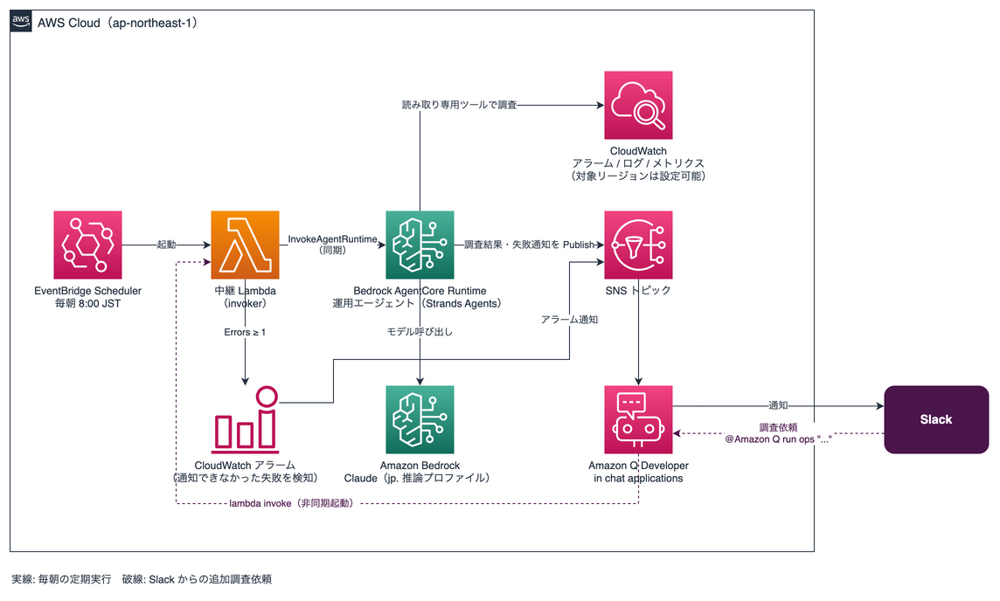

# ops-agent-sample-on-aws

AWS アカウントの日次ヘルスチェックを行う運用エージェントのサンプルです。

毎朝定時に [Amazon Bedrock AgentCore](https://aws.amazon.com/bedrock/agentcore/) 上のエージェント（[Strands Agents](https://strandsagents.com/) / Python）が起動し、過去 24 時間の CloudWatch（アラーム・ログ・メトリクス）を自律的に調査します。見つけた問題に 0〜100 点のスコアを付け、結果を SNS 経由で Slack に通知します。

通知を読んで気になった点は、その場で Slack から追加調査を依頼できます。

```
@Amazon Q run ops "my-api-function のエラーが増えた原因を詳しく"
```

## アーキテクチャ



（実線が毎朝の定期実行、破線が Slack からの追加調査依頼の経路です）

- エージェントには CloudWatch の調査ツール（boto3 の薄いラッパー、読み取り専用）だけを渡し、どこをどう深掘りするかはエージェント自身が判断します
- 採点結果は Pydantic モデルの構造化出力で受け取り、通知メッセージの整形と SNS 発行は LLM を介さない通常のコードで行います
- レポート文面の書式（改行・箇条書き・文体）は [Strands の Skills 機能](https://strandsagents.com/docs/user-guide/concepts/plugins/skills/) で定義しています（`agent/src/ops_agent/skills/` 配下の SKILL.md）
- 問題ゼロの日も「異常なし」のサマリを毎日 1 通送るため、通知が来ないこととエージェントの停止を区別できます
- Slack からの依頼も同じ中継 Lambda・同じエージェントを通り、回答は同じチャンネルに返ります。エージェントが行うのは調査と報告までで、書き込み系の操作は行いません

設計の経緯と決定事項は [docs/DESIGN.md](docs/DESIGN.md) を参照してください。

## 前提条件

| ツール | 用途 |
|--------|------|
| [mise](https://mise.jdx.dev/) | Node.js / pnpm / uv のバージョン管理 |
| Docker | エージェントのコンテナイメージビルド（linux/arm64） |
| AWS CLI + 認証情報 | デプロイ先アカウントへのアクセス |

このほか、デプロイ先リージョン（デフォルト: 東京）の Bedrock で Claude モデル
（デフォルト: `jp.anthropic.claude-sonnet-4-6`）が利用可能になっている必要があります。

## セットアップ

```sh
mise install          # Node.js / pnpm / uv を導入
pnpm install          # CDK 側の依存関係

# デプロイパラメータを作成（parameter.ts は gitignore 済み）
cp parameter.sample.ts parameter.ts

cd agent && uv sync   # エージェント側の依存関係（開発時のみ）
```

## デプロイ

```sh
# 初回のみ（CDK を使ったことがないアカウント/リージョンの場合）
pnpm cdk bootstrap

pnpm cdk deploy
```

デプロイが完了すると、毎朝 8:00 JST にエージェントが起動します。

### Slack 通知の設定（任意）

Slack 連携は [Amazon Q Developer in chat applications](https://docs.aws.amazon.com/chatbot/latest/adminguide/what-is.html)（旧 AWS Chatbot）を使います。シークレット管理は不要です。

1. AWS コンソールの Amazon Q Developer in chat applications で、Slack ワークスペースを承認する（初回のみ手動）
2. ワークスペース ID（`T` で始まる）とチャンネル ID（`C` で始まる）を控える
3. `parameter.ts` に設定してデプロイする

```ts
// parameter.ts
export const parameters: OpsAgentParameters = {
  // ...
  slackWorkspaceId: "TXXXXXXXX",
  slackChannelId: "CXXXXXXXX",
};
```

ID を設定しない場合は SNS トピックまで作成されるので、メール購読などでも動作確認できます。

なお日次通知の末尾には、後述する追加調査の依頼例が常に載ります。メール購読で使う場合や、依頼機能を使わない場合は、`agent/src/ops_agent/report.py` の `ADHOC_HINT` を編集または削除してください。

### Slack から追加調査を依頼できるようにする（任意）

Slack 連携を設定してデプロイすると、チャンネルから中継 Lambda を起動する権限（対象は中継 Lambda のみ）が付きます。あとはチャンネルで一度だけコマンドエイリアスを作れば、自由文で調査を依頼できます。

エイリアスはチャンネルごとの設定で CDK の管理外のため、Slack 上で作成します。関数名は `OpsAgentSampleOnAwsStack-invoker` 固定です（スタック名を変えた場合は `<スタック名>-invoker`。`pnpm cdk deploy` の出力 `InvokerFunctionName` にも表示されます）。

```
@Amazon Q alias create ops lambda invoke --function-name OpsAgentSampleOnAwsStack-invoker --invocation-type Event --payload {"trigger": "adhoc", "message": "$question"}
```

このコマンドは日次通知の末尾にも実名入りで載るので、通知からコピーしても構いません。

作成後は次のように依頼します。依頼文は空白を含むためクォートで括ってください。

```
@Amazon Q run ops "昨日の 22 時ごろからの Lambda エラーを詳しく調べて"
```

パラメータを明示したい場合は、同じエイリアスを `@Amazon Q run ops --question "..."` の形でも呼べます（フラグ名はエイリアス定義の変数名 `$question` に対応します）。

- 調査は数分かかるため、依頼を受け付けた時点でいったん応答が返り、回答はあとから同じチャンネルに通知されます
- 調査対象の期間は既定で `lookbackHours`（24 時間）です。「先週から」のような依頼があればエージェントが期間を広げますが、`maxLookbackHours`（デフォルト 168 時間）が上限です
- 調査が失敗した場合も、失敗した旨がチャンネルに通知されます

### 設定一覧（parameter.ts）

パラメータはリポジトリ直下の `parameter.ts`（[parameter.sample.ts](parameter.sample.ts) のコピー）で設定します。
`parameter.ts` は gitignore されているため、個人環境の値がコミットされることはありません。

| キー | デフォルト | 説明 |
|------|-----------|------|
| `scheduleCron` | `cron(0 8 * * ? *)` | 実行スケジュール（EventBridge Scheduler の cron 式） |
| `scheduleTimeZone` | `Asia/Tokyo` | スケジュールのタイムゾーン |
| `modelId` | `jp.anthropic.claude-sonnet-4-6` | エージェントが使う Bedrock モデル ID |
| `scoreThreshold` | `50` | 通知で強調するスコアの閾値 |
| `lookbackHours` | `24` | 調査対象の期間（時間） |
| `maxLookbackHours` | `168` | Slack からの依頼で遡れる期間の上限（時間） |
| `targetRegions` | `[]`（デプロイ先のみ） | 監視対象リージョンの配列 |
| `slackWorkspaceId` | なし | Slack ワークスペース ID |
| `slackChannelId` | なし | Slack チャンネル ID |

## 動作確認（手動実行）

スケジュールを待たずに試すには、中継 Lambda を直接呼び出します。

```sh
aws lambda invoke \
  --function-name OpsAgentSampleOnAwsStack-invoker \
  --cli-read-timeout 0 \
  --cli-binary-format raw-in-base64-out \
  --payload '{}' /dev/stdout
```

`--cli-read-timeout 0` は省略しないでください。調査には数分かかるため、AWS CLI の既定
（60 秒）ではタイムアウトし、リトライでエージェントが多重実行されて重複通知と余計な課金に
つながります。

## 開発

テスト駆動開発（TDD）で実装しています。Python 側は ruff（lint / フォーマット）と ty（型チェック）、CDK 側は tsc + jest を使います。

```sh
# Python（agent/ ディレクトリで実行）
uv run pytest             # テスト
uv run ruff format .      # フォーマット
uv run ruff check .       # lint
uv run ty check           # 型チェック

# CDK（リポジトリルートで実行）
pnpm build                # 型チェック
pnpm test                 # jest（Template アサーション）
pnpm cdk synth --quiet    # synth 確認
```

## セキュリティに関する注意

- エージェントはログ本文という信頼できない入力を読むため、理論上はログに仕込まれた指示文によるプロンプトインジェクションがあり得ます。このサンプルでは、エージェントに読み取り専用ツールだけを渡し、通知の整形・送信を LLM を介さないコードで行うことで、実害につながる経路を塞いでいます
- ツールの追加などで拡張する場合も、書き込み系の権限をエージェントに与えない方針を維持することをおすすめします
- Slack からの依頼はチャンネル参加者を信頼するモデルです。チャンネルから実行できるのは中継 Lambda の起動だけに絞っていますが（チャネルロールとガードレールポリシーの両方で制限）、依頼できる相手を絞りたい場合はチャンネルの参加者を管理してください

## コストに関する注意

- 実行のたびに Bedrock のモデル呼び出し料金と Logs Insights のクエリ料金（スキャン量課金）が発生します
- エージェントが自律的にクエリを発行するため、ログが大量にあるアカウントではスキャン量が膨らむ可能性があります。まずはログの少ない検証用アカウントでの実行をおすすめします
- Slack からの依頼は 1 回ごとに同じだけの費用が発生します。多重実行の制限は設けていないため、連投すればその分だけ課金されます。期間を広げる依頼（`maxLookbackHours` まで）はスキャン量も増えます

## 拡張のアイデア

- 会話の継続: いまは依頼のたびに独立したセッションで実行するため、「さっきの件をもっと詳しく」には答えられません。セッション ID の引き回しや履歴保持を足せば対話を継続できます
- 調査結果の永続化: 詳細レポートを S3 に保存すれば、後からの振り返りや監査に使えます
- AgentCore Observability: トレースを有効化すると、エージェントの思考過程やツール呼び出しを CloudWatch で確認できます
